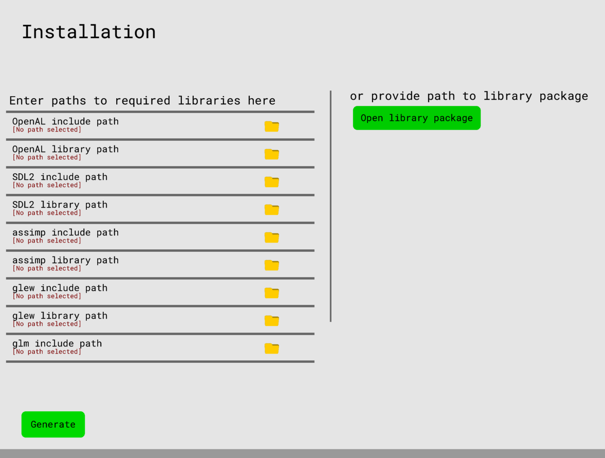
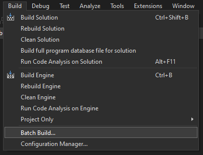
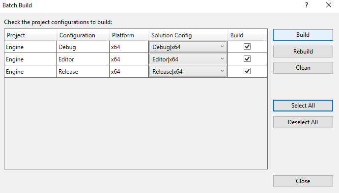

# Installing the engine

## Visual Studio

The engine requires both include files (headers) and libraries of:

* [glm (header only)](https://github.com/g-truc/glm/)
* [SDL2](https://github.com/libsdl-org/SDL/releases/tag/release-2.24.2)
* [glew](https://github.com/nigels-com/glew)
* [OpenAL Soft](https://github.com/kcat/openal-soft)
* [assimp](https://github.com/assimp/assimp)

The paths to both the include paths and library paths to these libraries
must be supplied to the Launcher/ProjectGenerator.

Once this is done, Visual Studio project files for the engine can be generated. Press the green "Generate" button.

Now the engine binaries need to be built. In Visual Studio, click `Build`, then `Batch Build`. Then `Select All` and `Build`.

After the binaries are built, open the launcher again. You can now create a new project or import an existing project.

## GNU make

> TODO
